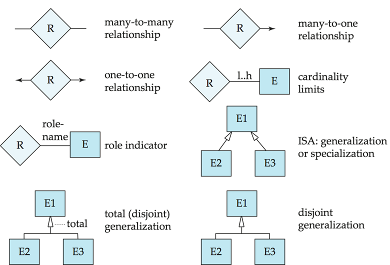

### Chapter 7:  Entity-Relationship Model

#### Modelling

* A data base can be modeled as
  * a collection of **entities**
  * relationship among **entities**
* **Entity**
  * a distinguishable object
  * have **attributes**
  * **entity set**
* **Relationship**: an association among several entities
* **Relationship set**: $\{(e_1,\ldots,e_n)|e_1\in E_1,\ldots e_n\in E_n\}$, $E_k$ are entity sets and each $(e_1,\ldots,e_n)$ is a relationship
  * may have an **attribute**, e.g. *instructor* and *student* may have the attribute *date* 
  * **Degree**: most **binary**
* **Attributes**
  * Domain
  * Type
    * Single / composite
    * Single-valued / multivalued
    * Derived (can be computed from others)
* **Mapping Cardinality Constraints**
  * One to one
  * One to many
  * Many to one
  * Many to many 
* **Keys**: super key, candidate key, primary key
* Redundant attributes

#### E-R Diagrams

* **Rectangle**: entity set
  * Attributes list inside the rectangle
  * Underline: primary key
* **Diamond**: relationship set
* Composite attribute: components list after with indent
* Multivalued attribute: add \{\}: e.g. *{phone_number}*
* Derived attribute: append (): e.g. *age( )*
* Relationship set with attributes: **dashed** line linking a rectangle with the diamond
* **Roles**: Each occurrence of an entity set plays a “role” in the relationship
  e.g. relationship *prereq*(*course_id*, *prereq_id*), *course_id*, *prereq_id* are roles
* **Cardinality Constraints**
  * One to one: $\leftrightarrow$
  * One to many: $\leftarrow$
  * Many to one: $\to$
  * Many to many: $-$
* **Total participation**(**double** line): every entity in the entity set participates in at least one relationship in the relationship set, e.g. *section*
  * Partial participation: some entities may not participate, e.g. *instructor* in *advisor*
* **Ternary relationship**: more than binary relationship

#### ER design

* **weak entity set**: has not primary key
  * depends on **identifying entity set**
  * **identifying  relationship**: **double** diamond
  * **discriminator (or partial key)**: set of attributes to distinguish, noted by **dashed** underline
  * primary key of weak entity set = partial key + primary key of strong entity set (dependent)
* **Reduction to Relation Schemas**
  * A strong entity set reduces to a schema with the same attributes
  * A weak entity set becomes a table that includes a column for the primary key of the identifying strong entity set
  * A many-to-many relationship set is represented as a schema with attributes for the primary keys of the two participating entity sets, and any descriptive attributes of the relationship set
* **Redundancy of Schemas**
  * Many-to-one and one-to-many relationship sets that are total on the many-side can be represented by adding an extra attribute to the “many” side, containing the primary key of the “one” side
  * For one-to-one relationship sets, either side can be chosen to act as the “many” side
* Composite attributes: for each component
* A multivalued attribute M of an entity E is represented by a separate schema EM

#### Extended ER Features

* **Specialization**
  * Top-down design
  * Attribute inheritance 
* **Generalization**
  * Bottom-up design
  * superclass-subclass relationship
* **Aggregation**
* **Representing Specialization via Schemas**
  1. Form a schema for the higher-level entity, form a schema for each lower-level entity set, include primary key of higher-level entity set and local attributes
  2. Form a schema for each entity set with all local and inherited attributes
* **Representing Aggregation via Schemas**
  * primary key of the aggregated relationship
  * the primary key of the associated entity set
  * any descriptive attributes

#### Summary of symbols

### Chapter 8:  Relational Database Design

* **Functional dependency**
* **Lossy decomposition**
* **Lossless-Join Decomposition**
  e.g 
  *R=(A, B, C)    R1=(A, B)    R2=(B, C)*
  *r* : (($\alpha$, 1, A), ($\beta$, 2, B))    *r1* : (($\alpha$, 1), ($\beta$, 2))    *r2* : (1, A), (2, B)
  then *r1* $\Join$ *r2* = *r*
* **First Normal Form**
  * all domains are **atomic** 
* **Goal**: decide whether relation *R* is "good" form, if not, divide into "good" forms which is Lossless-Join Decomposition

#### Functional Dependencies

* **Definition**: *R* : relational schema, $\alpha\subseteq R$ and $\beta\subseteq R$ 
  					A ***functional dependency*** $\alpha\to\beta$ **holds on** *R* iff any two tuples $t_1, t_2$
  					$t_1[\alpha]=t_2[\alpha]\Rightarrow t_1[\beta]=t_2[\beta]$
  * *K* is a superkey for relation schema *R* if and only if *K* $\to$ *R*
  * Satisfy: *r* legal under *F*, then *r* satisfies *F*
  * Hold on: all relations on *R* satisfy *F*, then *F* holds on *R*
  * Trivial: In general, $\alpha\to\beta$ is trivial if $\beta\subseteq\alpha$, i.e. satisfied by all instances of a relation
* **Closure**
  * *A* $\to$ *B* and *B* $\to$ *C* $\implies$ *A* $\to$ *C*
  *  The set of **all** functional dependencies logically implied by *F* is the **closure** of *F*, denoted *F*$^+$
  * **Armstrong’s Axioms**
    * $\beta\subseteq\alpha\implies\alpha\to\beta\quad$ **reflexivity**
    * $\alpha\to\beta \implies \gamma\alpha\to\gamma\beta \quad$**augmentation**
    * $\alpha\to\beta \and \beta\to\gamma \implies \alpha\to\gamma \quad$**transitivity**
  * **Additional rules**
    * $\alpha\to\beta \and \alpha\to\gamma \implies \alpha\to\beta\gamma \quad$**union**
    * $\alpha\to\beta\gamma \implies  \alpha\to\beta \and \alpha\to\gamma\quad$**decomposition**
    * $\alpha\to\beta\and\gamma\beta\to\delta \implies \alpha\gamma\to\delta\quad$**pseudotransitivity**
* **Closure of Attribute Sets**
  * Given a set of attributes $\alpha$, define the closure of a under *F* (denoted by $\alpha^+$) as the set of attributes that are functionally determined by a under *F*
  * Algorithm:
    *result* := $\alpha$
    **while** (changes of *result*) **do**
        **for each** $\beta\to\gamma$ **in** *F* **do**
            **if** $\beta\subseteq$ *result* **then** *result* := *result* $\cup\ \gamma$
  * Usages
    * test for superkey
    * test functional dependencies
    * compute closure of *F*
      For each $\gamma\subseteq$ *R* , for each *S* $\subseteq\gamma^+$ , output dependency $\gamma\to$ *S*
* **Extraneous Attributes**: for dependency $\alpha\to\beta$, *A* $\in\alpha$ is **extraneous** in $\alpha$ if *F* implies $(F-\{\alpha\to\beta\})\cup\{(\alpha-A)\to\beta\}$; *A* $\in\beta$ is **extraneous** in $\beta$ if $(F-\{\alpha\to\beta\})\cup\{\alpha\to(\beta-A)\}$ implies *F*
  e.g. *F* = *{A* $\to$ *C, AB* $\to$ *C}*, then *B* is extraneous in *AB* $\to$ *C*
         *F* = *{A* $\to$ *C, AB* $\to$ *CD}*, then *C* is extraneous in *AB* $\to$ *CD*
  * Testing *A* is extraneous in $\alpha$ 
    1. Compute $(\alpha-A)^+$ using *F*
    2. Check $(\alpha-A)^+$ contains $\beta$, if yes, *A* is extraneous in $\alpha$ 
  * Testing *A* is extraneous in $\beta$
    1.  Compute $\alpha^+$ using $(F-\{\alpha\to\beta\})\cup\{\alpha\to(\beta-A)\}$
    2. Check $\alpha^+$ contains $\alpha$, if yes, *A* is extraneous in $\beta$ 
* **Canonical Cover** *Fc* for *F* such that *F* implies *Fc* and *Fc* implies *F*. No *f* in *Fc* contains extraneous attribute and left side of *f* is unique
  * Algorithm
    * Replace $\alpha\to\beta_1$ and $\alpha\to\beta_2$ in *F* with $\alpha\to\beta_1\beta_2$
    * Delete all extraneous attributes
* **Lossless-join Decomposition**
  * A decomposition of *R* into *R*1 and *R*2 is lossless join if at least one of the following dependencies is in *F*+:
    * *R1* $\cap$ *R2* $\to$ *R1*
    * *R1* $\cap$ *R2* $\to$ *R2*
* **Dependency Preservation**: Let *Fi* be the set of dependencies *F* *+* that include only attributes in *Ri*, a decomposition is dependency preserving if $(F_1\cup\ldots\cup F_n)^+=F^+$
  * Testing
    *result* := $\alpha$
    **while** (changes of *result*) **do**
        **for each** $R_i$ **in** decomposition **do**
            *t* := (*result* $\cap$ *Ri*)$^+$ $\cap$ *Ri*
            *result = result* $\cup$ *t*
    if *result* contains all attributes in $\beta$, then it is dependency preserving

#### Boyce-Codd Normal Form (BCNF)

* *R* is in BCNF with set *F* of functional dependencies if all $(\alpha\to\beta)\in F$, at least one holds:
  * $\alpha\to\beta$ is trivial
  * $\alpha$ is superkey
* Decomposing a Schema into BCNF: We decompose *R* into 2 parts
  * $\alpha\cup\beta$
  * $R-(\beta-\alpha)$
* Testing BCNF
* Testing Decomposition BCNF
  * For every set of attributes $\alpha\subseteq$ *Ri*, check that $\alpha^+$ (the attribute closure of $\alpha$) either includes no attribute of *Ri* - $\alpha$, or includes all attributes of *Ri*
    * If condition is violated by some $\alpha$ in *Ri*, the dependency $\alpha\to(\alpha^+-\alpha)\cap R_i$ is hold on *Ri*
* **BCNF Decomposition Algorithm**
  *result* := {*R*}
  *done* := false
  **while** (**not** done) **do**
      **if** (there is *Ri* in result not in BCNF) **then**
          let $\alpha\to\beta$ be a nontrivial that holds on *Ri* s.t. $\alpha\to$ *Ri* is not in $F^+$ and $\alpha\cap\beta=\varnothing$
          *result* = (*result* - *Ri*) $\cup$ (*Ri* - $\beta$) $\cup$ ($\alpha,\beta$)
      **else** done = **true**

#### Third Normal Form (3NF)

* *R* is **3NF** iff for all $\alpha\to\beta$ in $F^+$, at least one holds:
  * $\alpha\to\beta$ is trivial
  * $\alpha$ is superkey
  * each attribute *A* in $\beta-\alpha$ is contained in candidate key for *R*