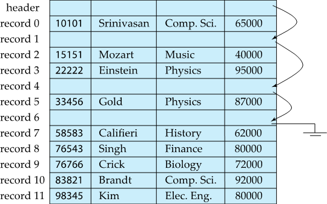
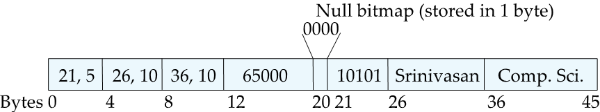
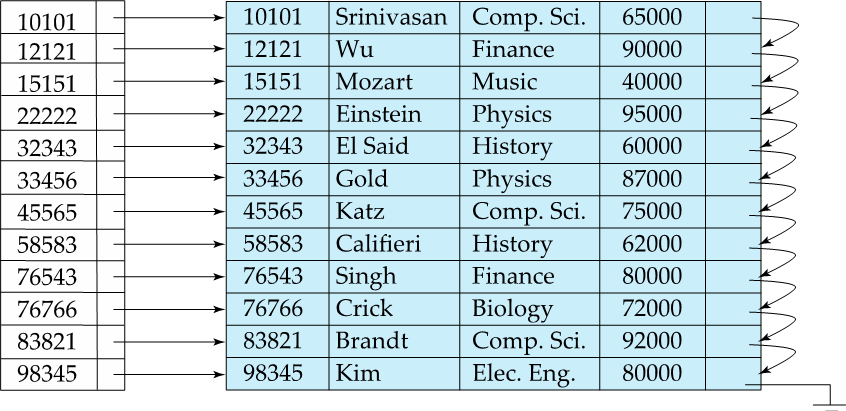
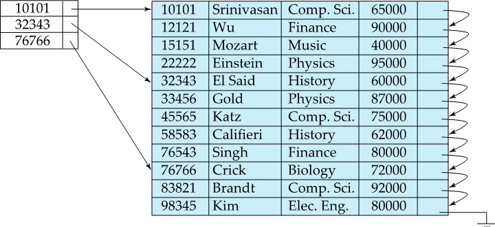
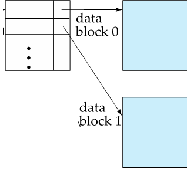
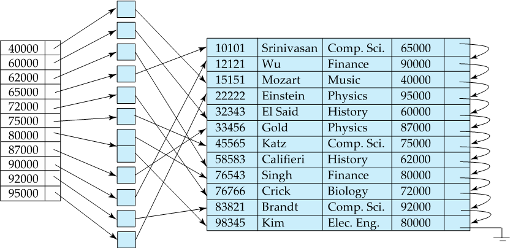
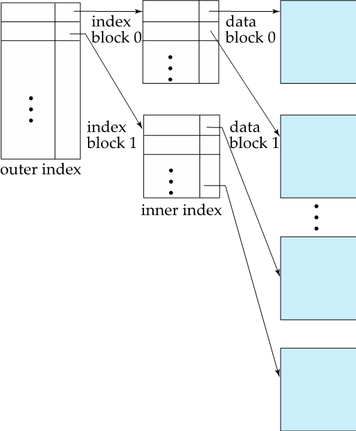

### Chapter 10: File Organization, Record Organization and Storage Access

#### Records

* **Fixed-Length Records - Free Lists **
  
  * Store the address of the first deleted record in the file header
  * Use this first record to store the address of the second deleted record, and so on
  * address: "pointer"
* **Variable-Length Records**
  
  * Represented by fixed length: *(offset, length)*, actual data stored after all fixed length attribute (starts at *offset*)
  * Null values represented by *null-value bitmap*
* **Variable-Length Records - Slotted page structure**
  * Header
    * number of record
    * end of free space
    * location and size of each
  * Pointers: point to the entry for record in header

#### Storage Access

* **block**: fixed-length storage units
* **buffer**: in memory
* **Buffer Manager**: When need a block in disk:
	1. Block in buffer, returns the address in memory  
	2. Block not in buffer
     	1. Allocate space in buffer
           	1. Replace other blocks for new block (if required)
            2. Replaced block write back to disk only if it was modified
        2. Reads the new block from disk to buffer and return memory address
* Buffer Replacement Policies
  * **least recently used (LRU)**
  * **Pinned block**: not allowed to written to disk
  * **Toss-immediate**: free space of block as soon as the final tuple of it is processed
  * **most recently used (MRU)**

### Chapter 11: Indexing and Hashing

* **Dense Index**: Index record appears for every search-key value in the file
  
* **Sparse Index**: contains index records for only some search-key values
  
  * Good tradeoff: sparse index with an index entry for every block in file, corresponding to least search-key value in the block
    
* **Secondary Indices**: have to be dense
  
* **Multilevel Index**
  

#### B+ Tree

* See [BPTree.md](https://github.com/failure-P32/BPlusTree/blob/master/BPTree.md)

* **Height of B+ Trees**: $h \leq \lceil\log_{\lceil n/2\rceil}(K)\rceil$

