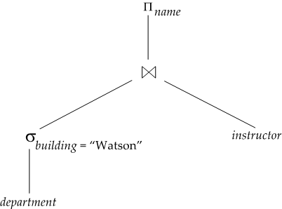

### Chapter 12: Query Processing

* **Basic steps**
  1. Parsing and translation
  2. Optimization
  3. Evaluation
* **Measures of Query Cost**
  * Number of **block transfers** $b$ and number of **seeks** $S$
  * $t_T$: time per block transfer; $t_S$: time per seek
  * $bt_T+St_S$
  * ignore CPU costs, write output

#### Selection

* **File scan** 
  **A1**: linear search
  * Cost estimate = $b_r$ block transfers + 1 seek
    * $b_r$ = number of blocks from relation *r*
  * On key attribute (stop on finding once): 
    * Cost = $b_r$/2 block transfers + 1 seek
* **Index scan**
  * **A2**: primary index, equality on key
    * Cost = $(h_i+1)(t_T+t_S)$
  * **A3**: primary index, equality on non-key
    * Records will be on consecutive blocks, let $b$ = number of blocks containing matching records
    * Cost = $h_i(t_T+t_S)+t_S+t_Tb$
  * **A4**: secondary index, equality on non-key
    * If search-key is candidate (retrieve single record)
      Cost = $(h_i+1)(t_T+t_S)$
    * Retrieve multiple records
      Cost = $(h_i+n)(t_T+t_S)$: $n$ matching records may be on different block
  * **A5**: primary index, comparison
  * **A6**: secondary index, comparison
* **Complex Selections**
  * Conjunction
    * **A7**: conjunctive selection using one index
    * **A8**: conjunctive selection using composite index (multi-key index if available)
    * **A9**: conjunctive selection using intersection of identifiers
  * Disjunction
    * **A10**: disjunctive selection by union of identifiers
      * Applicable if *all* conditions have available indices
      * Otherwise linear scan
  * Negation: linear scan

#### External Merge-Sort

1. Create sorted ***runs***
2. Merge the runs: *M* = memory size, *N* way merge

* Cost analysis: $b_b$ blocks per run, merge $\lfloor M/b_b \rfloor - 1$ runs in one pass
  * Total number of merge passes required: $\log_{\lfloor M/b_b \rfloor - 1}(b_r/M)$
  * Total number of block transfers: $b_r(2\lceil \log_{\lfloor M/b_b \rfloor - 1}(b_r/M) \rceil + 1)$
  * Total number of seeks: $2\lceil b_r/M \rceil +\lceil b_r/b_b \rceil(2\lceil \log_{\lfloor M/b_b \rfloor - 1}(b_r/M)\rceil - 1) $

#### Join Operation

Theta Join: $r\Join_\theta s$

* **Nested-Loop Join**:
  **for each** tuple $t_r$ **in** *r* **do**
      **for each** tuple $t_s$ **in** *s* **do**
          test if $(t_r,t_s)$ satisfies join condition $\theta$
          If yes, add to result

  * *r*: outer relation, *s*: inner relation
  * Worst case: memory only hold on block of each relation
    Cost = $(n_rb_s+b_r)$ block transfers + $(n_r+b_r)$ seeks
  * Enough memory: Cost = $b_r+b_s$ block transfers + 2 seeks

* **Block Nested-Loop Join**
  **for each** block $B_r$ **of** *r* **do**
      **for each** block $B_s$ **of** *s* **do**
          **for each** tuple $t_r$ **in** *r* **do**
              **for each** tuple $t_s$ **in** *s* **do**
                  Check if $(t_r,t_s)$ satisfies join condition $\theta$
                  If yes, add to result

  * Worst case: $(b_rb_s+b_r)$ block transfers + $2b_r$ seeks
  * Best case: $(b_r+b_s)$ block transfers + $2$ seeks
  * Improvement: use 2 blocks to buffer *r* and *s*
    cost = $(\lceil b_r/(M-2) \rceil b_s + b_r)$ block transfers + $2\lceil b_r/(M-2) \rceil$ seeks

* **Indexed Nested-Loop Join**

  * Use index to look up tuple in *s* (inner relation)
  * Cost = $b_r(t_T+t_S)+n_rc$
    * $c$ is the cost of traversing index and fetch matching tuples of *s* (height + 1)

* **Merge-Join**

  * Cost = $(b_r+b_s)$ block transfers + $(\lceil b_r/b_b \rceil + \lceil b_s/b_b \rceil )$ seeks + cost of sorting (if relations unsorted)

* **Hash-Join**

  * Algorithm

    1. Partition *s* and *r* using hash function *h*
    2. For each *i*
       1. Load $s_i$ into memory and build in-memory index
       2. Read $r_i$ one by one and join

    * *s*: build input, *r*: probe input

  * Recursive partitioning: if partition number *n* > number of pages in memory *M*

  * Cost

    * Non-recursive: $2(b_r+b_s)+2n_h$(partition)$+(b_r+b_s)+2n_h$(build and probe) transfers + $2(\lceil b_r/b_b \rceil + \lceil b_s/b_b \rceil )$(partition)$+ 2n_h$(build and probe) seeks
    * Recursive: $(2(b_r+b_s)\lceil \log_{\lfloor M/b_b\rfloor - 1}(b_s/M) \rceil+b_r+b_s)$ transfers + $(2(\lceil b_r/b_b \rceil + \lceil b_s/b_b \rceil )\lceil \log_{\lfloor M/b_b\rfloor - 1}(b_s/M) \rceil)$ seeks
    * All can be kept in main memory (no partition required): $b_r+b_s$

#### Evaluation of Expressions

* **Materialization**
  * Materialized evaluation: evaluate one operation at a time, starting at the lowest-level. Use intermediate results materialized into temporary relations to evaluate next-level operations.
    
* **Pipelining**
  * Pipelined evaluation: evaluate several operations simultaneously, passing the results of one operation on to the next

### Chapter 13: Query Optimization

#### Generating Equivalent Expressions

* **Equivalence Rules**
  * $\sigma_{\theta_1\and\theta_2}(E)=\sigma_{\theta_1}(\sigma_{\theta_2}(E))$
  * $\sigma_{\theta_1}(\sigma_{\theta_2}(E))=\sigma_{\theta_2}(\sigma_{\theta_1}(E))$
  * $\Pi_{L_1}(\Pi_{L_2}(\ldots(\Pi_{L_n}(E))))=\Pi_{L_1}(E)$
  * $\sigma_{\theta_1}(E_1\Join_{\theta_2}E_2)=E_1\Join_{\theta_1\and\theta_2}E_2$
    * $\sigma_{\theta}(E_1\times E_2)=E_1\Join_{\theta}E_2$
  * $E_1\Join_{\theta_2}E_2=E_2\Join_{\theta_2}E_1$
  * $(E_1\Join E_2)\Join E_3 = E_1\Join(E_2\Join E_3)$
    * $(E_1\Join_{\theta_1} E_2)\Join_{\theta_2\and\theta_3} E_3 = E_1\Join_{\theta_1\and\theta_3}(E_2\Join_{\theta_2} E_3)$
  * $\sigma_{\theta_0}(E_1\Join_{\theta}E_2)=(\sigma_{\theta_0}(E_1))\Join_\theta E2$ if $\theta_0$ involves only attributes of $E_1$
    * $\sigma_{\theta_1\and\theta_2}(E_1\Join_{\theta}E_2)=(\sigma_{\theta_1}(E_1))\Join_\theta(\sigma_{\theta_2}(E_2))$ if $\theta_1$ involves $E_1$ and $\theta_2$ involves $E_2$
  * $\Pi_{L_{1} \cup_{L_{2}}}\left(E_{1} \Join_{\theta} E_{2}\right)=\left(\Pi_{L_{1}}\left(E_{1}\right)\right) \Join_{\theta}\left(\Pi_{L_{2}}\left(E_{2}\right)\right)$ if $\theta$ involves only $L_1\cup L_2$
  * $E_{1} \cup E_{2}=E_{2} \cup E_{1}$, $E_{1} \cap E_{2}=E_{2} \cap E_{1}$
  * $\left(E_{1} \cup E_{2}\right) \cup E_{3}=E_{1} \cup\left(E_{2} \cup E_{3}\right)$, $\left(E_{1} \cap E_{2}\right) \cap E_{3}=E_{1} \cap\left(E_{2} \cap E_{3}\right)$
  * $\sigma_{\theta}\left(E_{1}-E_{2}\right)=\sigma_{\theta}\left(E_{1}\right)-\sigma_{\theta}\left(E_{2}\right)$ similarly for $\cup,\cap$
  * $\sigma_{\theta}\left(E_{1}-E_{2}\right)=\sigma_{\theta}\left(E_{1}\right)-E_{2}$ similarly for $\cap$ but not for $\cup$
  * $\Pi_{L}\left(E_{1} \cup E_{2}\right)=\left(\Pi_{L}\left(E_{1}\right)\right) \cup\left(\Pi_{L}\left(E_{2}\right)\right)$
* Example: for $(r_1\Join r_2)\Join r_3 = r_1\Join(r_2\Join r_3)$, if $r_2\Join r_3$ is large while $r_1\Join r_2$ is smaller, we choose $(r_1\Join r_2)\Join r_3$

#### Statistics for Cost Estimation

* **Statistical Information**

  * $n_r$: number of tuples in *r*
  * $b_r$: number of blocks containing tuples of *r*
  * $l_r$: size of a tuple of *r*
  * $f_r$: the number of tuples of r that fit into one block
    * $b_{r}=\left\lceil\frac{n_{r}}{f_{r}}\right\rceil$
  * $V(A,r)$: number of distinct values that appear in *r* for attribute *A*
    * $V(A,r)=\#\Pi_A(r)$

* **Selection Size Estimation**

  * $\sigma_{A=v}(r)$

    * estimate = $\frac{n_r}{V(A,r)}$
    * if *A* is key: estimate = 1

  * $\sigma_{A\leq v}(r)$

    * Let $c$ denote the size estimate

    * $$
      c=\left\{
      \begin{aligned}
      &0,\ v < \min(A,r)\\
      &n_r\frac{v-\min(A,r)}{\max(A,r)-\min(A,r)},\ \text{Otherwise}
      \end{aligned}
      \right.
      $$

* **Complex Selection Size Estimation**

  * **selectivity** of condition $\theta_i$: probability that a tuple in the relation *r* satisfies $\theta_i$
    * Let $s_i$ be number of satisfying tuples in *r*, then selectivity = $s_i/n_r$
  * **Conjunction** $\sigma_{\theta_1 \wedge \theta_2 \wedge \ldots \wedge \theta_n}(r)$: $c=n_{r} * \frac{S_{1} * S_{2} * \ldots * S_{n}}{n_{r}^{n}}$
  * **Disjunction** $\sigma_{\theta_1 \or\theta_2 \or\ldots \or\theta_n}(r)$: $c=n_{r} *\left(1-\left(1-\frac{s_{1}}{n_{r}}\right) *\left(1-\frac{s_{2}}{n_{r}}\right) * \ldots *\left(1-\frac{s_{n}}{n_{r}}\right)\right)$
  * **Negation** $\sigma_{^\neg \theta}(r)$: $c= n_r-\#\sigma_\theta(r)$

* 

