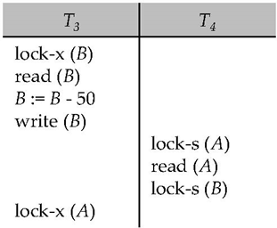

### Chapter 14: Transactions 

* **ACID Properties**
  * **Transaction**: a unit of program execution that accesses and possibly updates various data items. To preserve the integrity of data the database system must ensure:
    * **Atomicity**
    * **Consistency**
    * **Isolation**
    * **Durability**
* **Schedules**: sequence of instructions to specify the chronological order of instructions of concurrent transactions
  * A schedule must consist of all instructions
  * A successfully completed transaction will have **commit** instruction as last statement
  * A failed transaction will have **abort** instruction as last statement
* **Conflict Serializability**
  * **Conflict equivalent**: schedules *S* and *S'* can be transformed by swaps of non-conflicting instructions
  * *S* is **conflict serializable** if it's conflict equivalent to a serial schedule
* **Precedence Graph**: a direct graph where the vertices are the transactions 
  arc (path) $T_i \to T_j$ if two transactions conflict and $T_i$ accessed data earlier
* A schedule is conflict serializable **iff** its precedence graph is acyclic
  * If acyclic, the serializability order can be obtained by a ***topological sorting*** of the graph
* **Recoverable Schedules**: if a transaction $T_j$ reads a data item previously written by a transaction $T_i$ , then the commit operation of $T_i$ must appear before the commit operation of $T_j$
* **Cascading Rollbacks**: a single transaction failure leads to a series of transaction rollbacks
  
  None is committed thus recoverable. If $T_{10}$ fails, then $T_{11}$ and $T_{12}$ must roll back
* **Cascadeless schedules**: for each pair of transactions $T_i$ and $T_j$ such that $T_j$ reads a data item previously written by $T_i$, the commit operation of $T_i$ appears before the read operation of $T_j$. Cascadeless schedules are recoverable.
* **Levels of Consistency in SQL-92**
  * **Serializable**: default
  * **Repeatable read** : only read committed records, repeated reads return same value. But may not be serializable
  * **Read committed** : only read committed records, but repeated reads may not return same value.
  * **Read uncommitted** : uncommitted records can be read

### Chapter 15 : Concurrency Control 

* **Lock-Based Protocols **
  * Shared lock (S): any number of transactions can hold
  * Exclusive lock (X): no other transactions may hold
  * Lock-compatibility matrix
    
* **The Two-Phase Locking Protocol**
  * Phase 1: Growing Phase: may obtain, may not release
  * Phase 2: Shrinking Phase: may release, may not obtain
  * Assures serializability. Transactions can be serialized in order of **lock points** (the point where a transaction acquired its final lock)
  * To avoid cascading rollback
    * **strict two-phase locking**: a transaction holds all exclusive locks until commit/abort
    * **Rigorous two-phase locking **: all locks are held till commit/abort
* **Implementation of Locking**
  * **lock manager**
  * **lock table**
* **Lock Table**: implemented as an in-memory hash table indexed on the name of the data item being locked
  

#### Deadlocks

* **Deadlock** example
  
  Neither T3 nor T4 can make progress — executing  lock-S(B) causes T4 to wait for T3 to release its lock on B, while executing  lock-X(A) causes T3  to wait for T4 to release its lock on A.
* **Deadlock Handling**
  * **Deadlock prevention** protocols 
    * Requires transaction locks all its data item before beginning
    * Impose partial ordering
  * **wait-die** scheme 
  * **wound-wait** scheme 
  * **Timeout-Based Schemes**
* **Deadlock Detection**: *wait-for graph* *G = (V, E)*
  * *V*: vertices(transactions)
  * *E*: edges: $T_i$ is waiting for $T_j$ to release a data item, then $T_i\to T_j$ is in *E*
  * Cycle in wait-for graph
* **Deadlock Recovery**
  * Rollback
    * Total rollback
    * Only necessary
* **Granularity of locking **(level in tree)
  * fine granularity (lower in tree): high concurrency, high locking overhead
  * coarse granularity  (higher in tree): low locking overhead, low concurrency
* **Intention Lock Modes**
  * intention-shared (IS): indicates explicit locking at a lower level of the tree but only with shared locks.
  * intention-exclusive (IX): indicates explicit locking at a lower level with exclusive or shared locks
  * shared and intention-exclusive (SIX): the subtree rooted by that node is locked explicitly in shared mode and explicit locking is being done at a lower level with exclusive-mode locks.
* **Insert and Delete Operations**
  * **delete**: only if the transaction has an X-lock on the tuple
  * **insert**: the transaction is given an X-lock on the new tuple
  * **phantom phenomenon**: A transaction scans a relation while another inserts a tuple, if tuple locks are used, the scan transaction doesn't see the new tuple ("phantom data")

### Chapter 16: Recovery System

* **Log-Based Recovery**
  * **log** (sequence of log records) is kept on stable storage
  * **log records**: information about update activities on the database
  * $T_i$ starts: \<$T_i$ **start**>
  * $T_i$ execute **write**(*X*): \<$T_i$, $X$, $V_1$, $V_2$>
    * $V_1$: old value, $V_2$: new value
  * $T_i$ finishes: \<$T_i$ **commit**>
* **Transaction Commit**: when its commit log record is output to the stable storage
* **Undo** and **Redo** Operations
  * **Undo** of \<$T_i$, $X$, $V_1$, $V_2$> writes **old** value $V_1$ to *X*
    * when *X* restored to old value *V*, a special log record (**redo-only**) \<$T_i$, $X$, $V$> written
    * when undo of a transaction is complete, a log record \<$T_i$ **abort**> written
  * **Redo** of \<$T_i$, $X$, $V_1$, $V_2$> writes **new** value $V_2$ to *X*
    * No logging is done
  * **Undo** used for transaction rollback during normal operation
  * **Undo** and **Redo** used during recovery from failure
* **Transaction rollback (during normal operation)**
  Let $T_i$ to be transaction to rollback
  * Scan log backwards, for each log \<$T_i$, $X_j$, $V_1$, $V_2$>, perform undo by writing $V_1$ to $X_j$ and write log record \<$T_i$, $X_j$, $V_1$> (compensation log records)
  * Once \<$T_i$ **start**> found, stop and write log record \<$T_i$ **abort**>
* **Undo and Redo on Recovering from Failure**
  * $T_i$ needs to be undone if the log
    * contains \<$T_i$ **start**> but not contain \<$T_i$ **commit**> or \<$T_i$ **abort**>
  * $T_i$ needs to be redone if the log
    * contains \<$T_i$ **start**> and contain \<$T_i$ **commit**> or \<$T_i$ **abort**>

#### Checkpoints

* **Checkpointing**: periodically performed, all updates stopped meanwhile
  * Output all log records in memory onto stable storage
  * Output all modified blocks to disk
  * Write log record \<**checkpoint** *L*> where *L* is a list of all transactions active at the checkpoint
* **Recovery**
  * scan backwards to find the most recent \<**checkpoint** *L*>
  * Only transactions in *L* or started after *L* need to be redone / undone
  * Transactions before checkpoint have already output to stable storage
  * Continue scanning backwards till a record \<$T_i$ **start**> for every $T_i$ in *L*
  * Log prior to the earliest \<$T_i$ **start**> needn't recover
* Example
  
  $T_4$ undone, $T_2,T_3$ redone, $T_1$ ignored

#### Recovery Algorithm (summary)

* **Logging** (during normal operation) 
  \<$T_i$ start> at transaction start
  \<$T_i$, $X_j$, $V_1$, $V_2$>for each update, and 
  \<$T_i$ commit> at transaction end

* **Transaction rollback (during normal operation)** (Let $T_i$ be transaction to rollback) 
  Scan log backwards, for each log of the form \<$T_i$, $X_j$, $V_1$, $V_2$>

  * Perform undo by writing by writing $V_1$ to $X_j$ 
  * Write log record \<$T_i$, $X_j$, $V_1$>

  Once \<$T_i$ **start**> found, stop and write log record \<$T_i$ **abort**>

* **Recovery from failure**: Two phases

  * **Redo phase**:
    1. Find last \<**checkpoint** *L*> and set undo-list to *L*
    2. Scan forward from \<**checkpoint** *L*>
       1. When \<$T_i$, $X_j$, $V_1$, $V_2$> found, redo by writing $V_2$ to $X_j$ 
       2. When \<$T_i$ **start**> found, add $T_i$ to undo-list
       3. When \<$T_i$ **commit**> or \<$T_i$ **abort**> found, remove $T_i$ from undo-list
  * **Undo phase**:
    1. Scan log backwards
       1. When \<$T_i$, $X_j$, $V_1$, $V_2$> found and $T_i$ in undo-list
          1. Perform undo by writing by writing $V_1$ to $X_j$ 
          2. Write log record \<$T_i$, $X_j$, $V_1$>
       2. When \<$T_i$ **start**> found and $T_i$ in undo-list
          1. Write \<$T_i$ **abort**>
          2. Remove $T_i$ from undo-list
       3. Stop when undo-list is empty

* **Fuzzy Checkpointing**

  1. Temporarily stop all updates by transactions
  2. Write a \<**checkpoint** *L*> log record and force log to stable storage
  3. Note list *M* of modified buffer blocks
  4. Now permit transactions to proceed with their actions
  5. Output to disk all modified buffer blocks in list *M*
  6. Store a pointer to the **checkpoint **record in a fixed position **last_checkpoint** on disk
     * When recovering, start scan from **last_checkpoint**

* **Logical Undo Logging**
  Operations like B+ Tree can't be undone by restoring old values (physical undo) because the tree may have updated. Instead, insertion is undone by a deletion (**logical undo**)

  * Logging called **logical undo logging**
  * operations called **logical operations**

* **Operation Logging**

  1. When operation starts, log \<$T_i$, $O_j$,  **operation-begin**>. Here $O_j$ is a unique identifier of the operation instance.
  2. While operation is executing, normal log records with physical redo and physical undo information are logged. 
  3. When operation completes, <$T_i$, $O_j$,  **operation-end**, *U*> is logged, where *U* contains information needed to perform a logical undo information.

  * crash/rollback before operation complete: **operation-end** not found
    * physical undo information is used to undo operation
  * crash/rollback after operation complete: **operation-end** found
    * logical undo performed using *U*, while physical undo information for the operation ignored
  * Redo still using physical

* **Transaction Rollback with Logical Undo**

  * Scan the log backwards
    1. When \<$T_i$, $X_j$, $V_1$, $V_2$> found, perform undo and write \<$T_i$, $X_j$, $V_1$>
    2. When \<$T_i$, $O_j$, **operation-end**, *U*> found
       1. Rollback operation logically using undo information *U*
          1. Update performed during roll back are logged just like during normal operation execution.
          2. At the end of the operation rollback, generate a record 
             \<$T_i$, $O_j$, **operation-abort**>
       2. Skip all log records for $T_i$ until \<$T_i$, $O_j$,  **operation-begin**> found
    3. When a redo-only record is found ignore it
    4. When \<$T_i$, $O_j$, **operation-abort**> found, skip all preceding log records  for $T_i$ until \<$T_i$, $O_j$,  **operation-begin**> found
    5. Stop the scan when <$T_i$ **start**> found
    6. Add <$T_i$ **abort**> to the log

#### ARIES Recovery Algorithm

* **ARIES**
  * Use **log sequence number (LSN)** to identify log records
  * Physiological redo
  * Dirty page table to avoid unnecessary redoes during recovery
  * Fuzzy checkpointing that only records information about dirty pages, and does not require dirty pages to be written out at checkpoint time
* **Physiological redo**
  * page is physical, action within page can be logical
  * Used to reduce logging overheads
  * Requires page to be output to disk atomically
* **ARIES Data Structures**
  * Log sequence number (LSN) identifies each log record
    * sequentially increasing
    * an offset from beginning of log file to allow fast access
  * Page LSN
  * Log records of several different types
  * Dirty page table
* **Page LSN**: the LSN of the last record whose effects are reflected on the page
  * To update the page
    * X-latch and write log record
    * Update the page
    * Record the LSN of the log record in Page LSN
    * Unlock page
  * To flush page to disk
    * S-latch
* **Log Record**
  * | LSN | TransID |  PrevLSN  | RedoInfo  |  UndoInfo |
  * Redo-only record called **compensation log record (CLR)** used to log actions during recovery that needn't redone
    * Has a field UndoNextLSN to note next (earlier) record to be undone
      | LSN | TransID |  UndoNextLSN  |  RedoInfo |

* **DirtyPage Table**: List of pages in the buffer that have been updated, contains
  * PageLSN of the page
  * RecLSN is an LSN such that log records before this LSN have already been applied to the page version on disk
* **ARIES Data Structures** example
  
* **Checkpoint Log**, contains
  * DirtyPageTable and list of active transactions
  * For each active transaction, LastLSN, the LSN of the last log record written by the transaction
* **ARIES Recovery Algorithm**: involves 3 passes
  * **Analysis pass**: Determines
    * Which transactions to undo
    * Which pages were dirty
    * RedoLSN: LSN from which redo should start
  * **Redo pass**:
    * Repeats history, redoing all actions from RedoLSN 
      * RecLSN and PageLSNs are used to avoid redoing actions already reflected on page 
  * **Undo pass**:
    * Rolls back all incomplete transactions
      * Transactions whose abort was complete earlier are not undone
* **Analysis pass**
  * Start from last complete checkpoint
    * Reads DirtyPageTable from log record
    * Set RedoLSN = min RecLSNs of all pages in DirtyPageTable
      * If DirtyPageTable empty, RedoLSN = LSN of checkpoint
    * Set undo-list = list of transactions in checkpoint log record
    * Reads LSN of last log record for each transaction in undo-list from checkpoint log record
  * Scans forward from checkpoint
    * If log record for transaction not in undo-list, adds it
    * When an update log found, if page not in DirtyPageTable, added with RecLSN set to the LSN of update log record
    * If transaction end log record found, delete transaction from undo-list
    * Keeps track of last log record for each transaction in undo-list
  * End of the analysis pass
    * RedoLSN determines where to start redo pass
    * RecLSN for each page in DirtyPageTable used to minimize redo work
    * All transactions in undo-list need to be rolled back
* **Redo pass**
  * Scans forward from RedoLSN.  Whenever an update log record is found:
    * if page not in DirtyPageTable or LSN of the log record less than RecLSN of the page in DirtyPageTable, then skip
    * Otherwise fetch the page from disk. If PageLSN of the page fetched from disk less than LSN of the log record, redo the log record
* **Undo Actions**
  * When an undo is performed for an update log record
    * Generate a CLR containing the undo action performed (physically or physiologically)
    * Set UndoNextLSN of the CLR to the PrevLSN value of the update log record
  * ARIES supports partial rollback
* **Undo pass**
  * Performs backward scan on log undoing all transaction in undo-list
    * Backward scan optimized by skipping unneeded log records as follows:
      * Next LSN to be undone for each transaction set to LSN of last log record for transaction found by analysis pass.
      * At each step pick largest of these LSNs to undo, skip back to it and undo it 
      * After undoing a log record
        * For ordinary log records, set next LSN to be undone for transaction to PrevLSN noted in the log record
        * For compensation log records (CLRs) set next LSN to be undo to UndoNextLSN noted in the log record
  * Undos performed as described earlier
  * 

